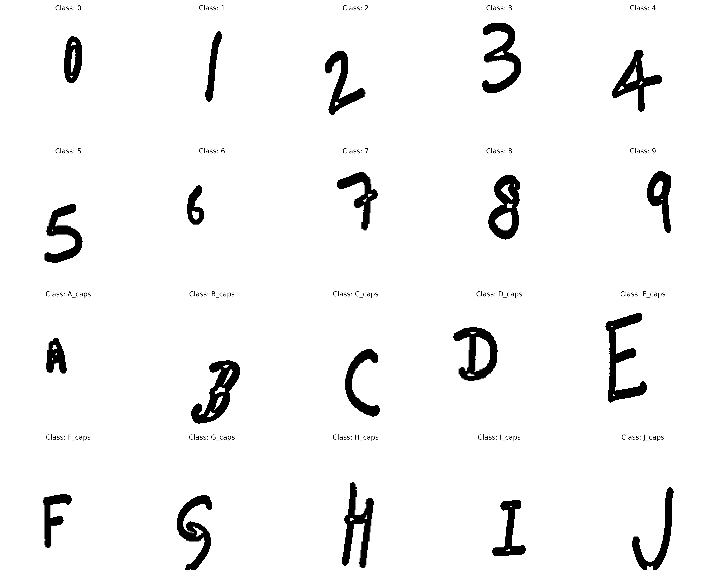
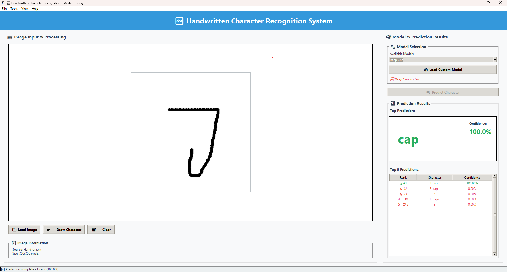
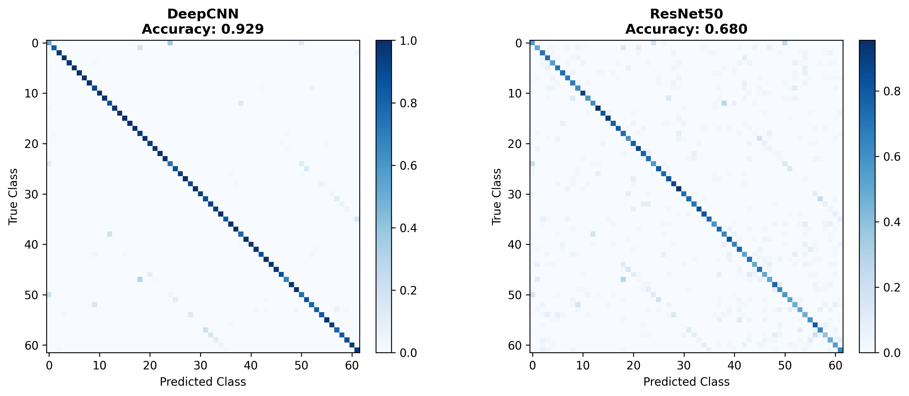

# Letter and Digit Identification

A deep learning project for recognizing handwritten English letters (A-Z, a-z) and digits (0-9) using Convolutional Neural Networks. Built with Python and Keras, this project leverages the [Handwritten English Characters and Digits Dataset](https://www.kaggle.com/datasets/sujaymann/handwritten-english-characters-and-digits?select=augmented_images) to achieve high-accuracy character recognition.



## 🎯 Objective

Train and compare deep learning models to classify handwritten letters and digits with high accuracy, and deploy an intuitive GUI application for real-time character recognition testing.

## 🗂️ Project Structure

```
Letter-and-Digit-Identification/
├── data/
│   ├── augmented_images1/        # Preprocessed and augmented dataset images
│   └── image_labels.csv          # Labels corresponding to each image
│
├── models/
│   ├── best_deep_cnn_model.h5    # Best trained Deep CNN model
│   ├── best_resnet50_model.h5    # Best trained ResNet50 model
│   └── class_names.txt           # List of class names (A-Z, a-z, 0-9)
│
├── results/
│   ├── confusion_matrices.png    # Confusion matrix visualization
│   ├── DeepCNN_training_history.png   # Deep CNN training metrics
│   ├── ResNet50_training_history.png  # ResNet50 training metrics
│   └── model_comparison.csv      # Performance comparison table
│
├── data_preprocessing.py         # Data loading and preprocessing utilities
├── gui_app.py                    # Interactive GUI testing application
├── gui_picture.png               # GUI interface preview
├── model.py                      # Neural network architecture definitions
├── requirements.txt              # Python package dependencies
├── sample_images.png             # Example dataset images
├── training.py                   # Complete training and evaluation pipeline
└── README.md                     # Project documentation
```

## 🚀 Quick Start

### 1. Setup Environment

```bash
# Clone the repository
git clone https://github.com/Ashish1455/Letter-and-Digit-Identification.git
cd Letter-and-Digit-Identification

# Install required packages
pip install -r requirements.txt
```

### 2. Prepare Dataset

Download the [Handwritten English Characters and Digits Dataset](https://www.kaggle.com/datasets/sujaymann/handwritten-english-characters-and-digits?select=augmented_images) from Kaggle and extract the dataset files into the `data/augmented_images1/` directory.

### 3. Train Models

Execute the complete training pipeline:

```bash
python training.py
```

This script will:
- Load and preprocess the dataset
- Train both Deep CNN and ResNet50 models
- Evaluate model performance
- Save trained models to `models/` directory
- Generate visualization results in `results/` directory

### 4. Test with GUI Application

Launch the interactive testing interface:

```bash
python gui_app.py
```

## 🖥️ GUI Application Features

The GUI application provides an intuitive interface for testing your trained models:



**Key Features:**
- **Load Images**: Import character images for testing
- **Model Selection**: Choose between trained models (Deep CNN, ResNet50)
- **Real-time Prediction**: Get instant character recognition results
- **Confidence Scoring**: View prediction confidence percentages
- **Simple Interface**: Clean, user-friendly design

**Usage:**
1. Select a trained model from the dropdown
2. Load an image containing a handwritten character
3. Click "Predict" to get recognition results
4. View the predicted character and confidence score

## 📊 Model Performance & Results

### Training Metrics Visualization

The project generates comprehensive performance visualizations:

- **Training History Graphs**: Monitor loss and accuracy progression during training
- **Confusion Matrix**: Detailed per-class performance analysis
- **Model Comparison**: Side-by-side accuracy and performance metrics



## 🧠 Model Architectures

### Deep CNN Model
- **Custom Architecture**: Optimized for character recognition
- **Layers**: Multiple convolutional layers with batch normalization
- **Regularization**: Dropout layers to prevent overfitting
- **Activation**: ReLU activation with softmax output

### ResNet50 Model
- **Transfer Learning**: Pre-trained ResNet50 backbone
- **Fine-tuning**: Custom classification head for 62 classes

## 🔧 Technical Requirements

### Dependencies
- Python 3.10
- TensorFlow/Keras 2.x
- NumPy
- Pandas
- Matplotlib
- Pillow (PIL)
- Tkinter (for GUI)
- OpenCV (optional, for advanced preprocessing)

## 📁 Key Files Description

| File | Purpose |
|------|---------|
| `training.py` | Complete model training and evaluation pipeline |
| `model.py` | Neural network architecture definitions |
| `data_preprocessing.py` | Data loading, augmentation, and preprocessing |
| `gui_app.py` | Interactive GUI application for testing |
| `requirements.txt` | Python package dependencies |

## 🎯 Supported Characters

The model recognizes **62 different classes**:
- **Digits**: 0, 1, 2, 3, 4, 5, 6, 7, 8, 9 (10 classes)
- **Uppercase Letters**: A-Z (26 classes)  
- **Lowercase Letters**: a-z (26 classes)

## 🚀 Future Enhancements

- [ ] Real-time webcam character recognition
- [ ] Complete word recognition
- [ ] Conversion from handwritten input to digital text

## 🙏 Acknowledgments

- [Handwritten English Characters and Digits Dataset](https://www.kaggle.com/datasets/sujaymann/handwritten-english-characters-and-digits) by Sujay Mann
- TensorFlow and Keras communities for excellent documentation
---

⭐ **Star this repository if you found it helpful!**
